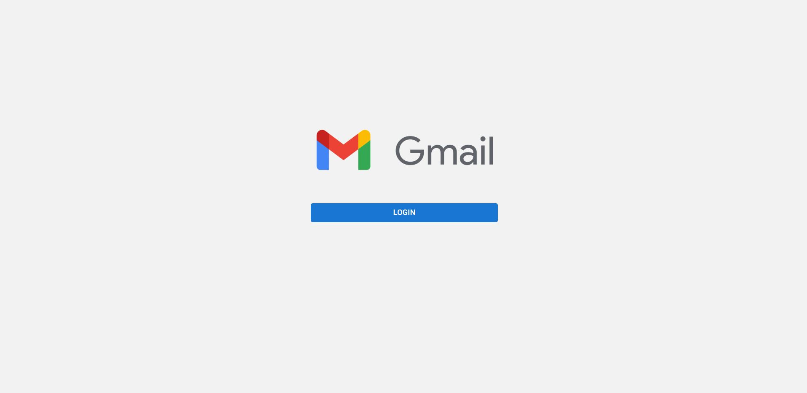
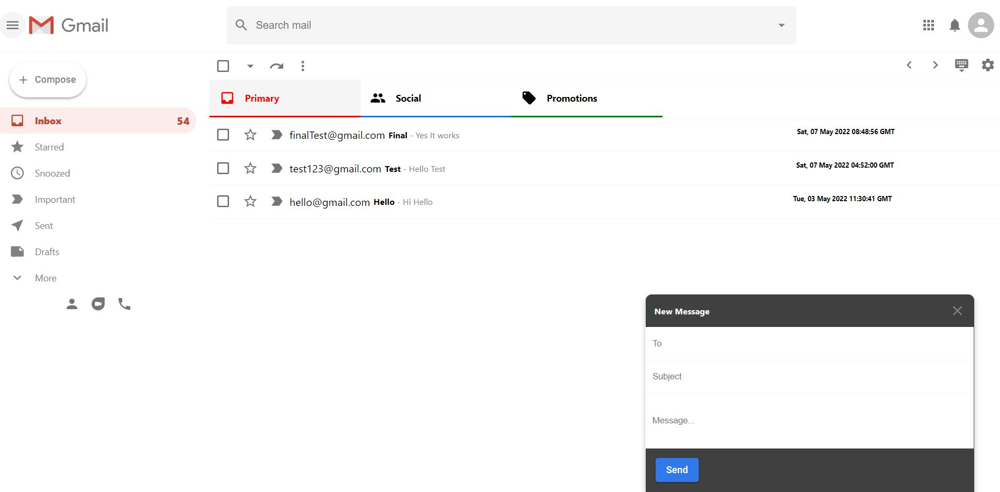

# Gmail Clone

- The app is the UI clone of gmail app made using React. Uses react with functional components, Firebase's **Google authentication**,
  **Firestore Database**, **Redux**, **Material UI icons (version 5.6)**, **React Router (version 6)**.

- The code follows best practices with modular and organized code. Also uses BEM naming convention for CSS as the best practice.

- The mails sent using compose functionality are stored in firestore database and retrieved realtime and displayed in the email list in inbox.

- The app is made solely for learning purpose and does not contain all gmail functionalities. This is the UI clone and created for better practical understanding of react especially firebase and redux.
